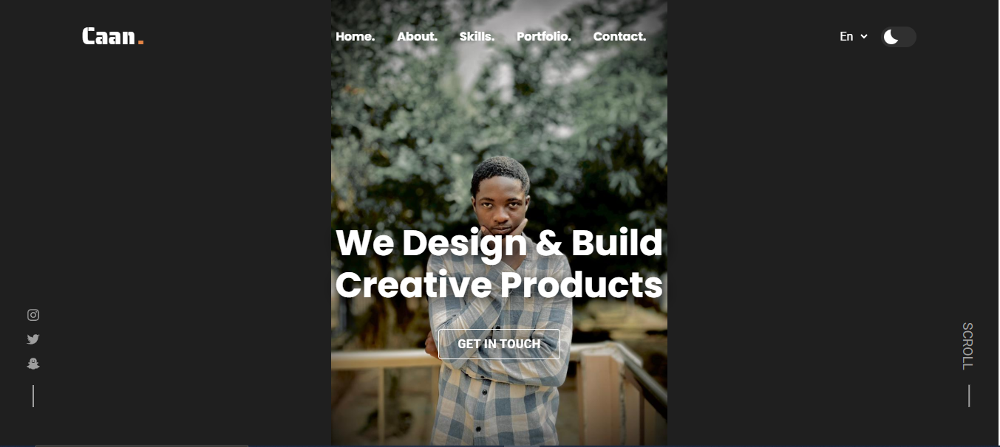
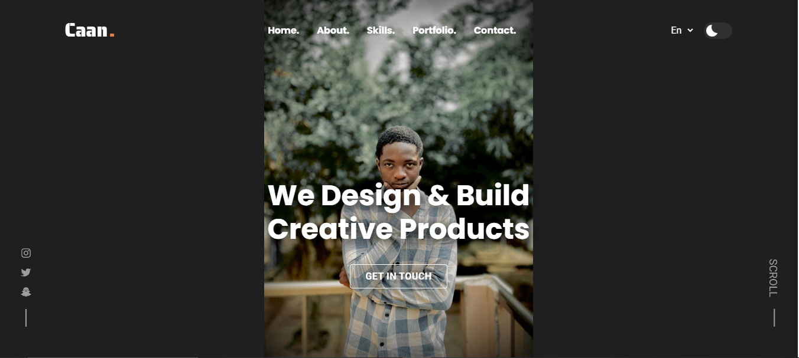

<div align="center">
  
  
  
  
 

  <br />
  <br />
  


  <h2 align="center">Caan - Personal portfolio</h2>

  This website is fully responsive personal portfolio, <br />Responsive for all devices, built using HTML, CSS, and JavaScript.

  <a href="https://nyamekyecaleb82.github.io/p/"><strong>➥ Live Demo</strong></a>

</div>

<br />

### Demo Screeshots




### Run Locally

To run **Caan-portfolio** locally, run this command on your git bash:

Linux and macOS:

```bash
sudo git clone https://github.com/TA-wiah/cann-portfolio.git
```

Windows:

```bash
git clone https://github.com/TA-wiah/cann-portfolio.git
```

### Contact

If you want to contact with me you can reach me at [Twitter](https://www.instagram.com/junior_billyhills).

### License

This project is **free to use** and does not contains any license.
